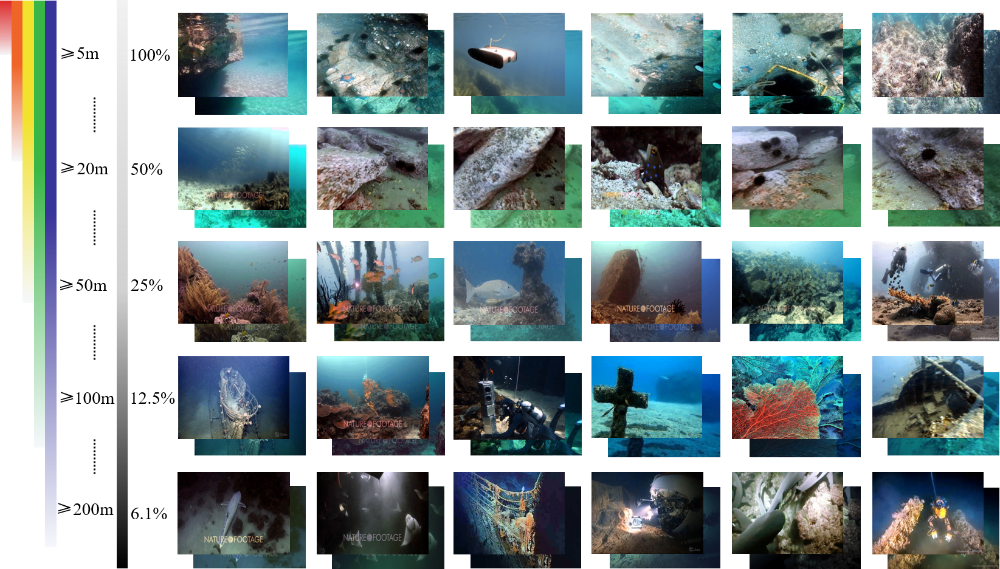
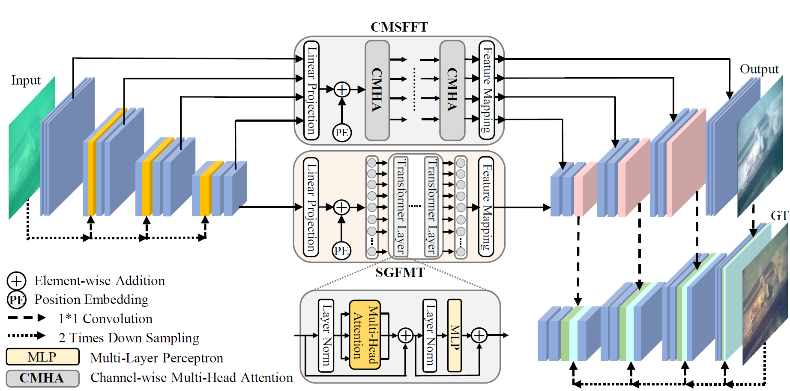

## Dataset
### LSUI
LSUI is a large-scale underwater image dataset including 5004 image pairs, which involve richer underwater scenes (lighting conditions, water types and target categories) and better visual quality reference images than the existing ones. You can download it from [here](https://pan.baidu.com/s/1rtHIwEmVp9BZDYJ_kb5Wfg). The password is 1iya.

​                                                                                     Fig. 1: LSUI Dataset

## Code
### U-shape Transformer 

You can find the official PyTorch implementation of U-shape Transformer  for Underwater Image Enhancement. ([arxiv](https://arxiv.org/abs/2111.11843), [Dataset](https://lintaopeng.github.io/_pages/UIE%20Project%20Page.html), [video demo](https://lintaopeng.github.io/_pages/UIE%20Project%20Page.html), [visual results](https://lintaopeng.github.io/_pages/UIE%20Project%20Page.html)) in [here](https://github.com/LintaoPeng/U-shape_Transformer_for_Underwater_Image_Enhancement). U-shape Transformer achieves **state-of-the-art performance** in underwater image enhancement task.

                                                                           Fig. 2: U-shape Transformer
