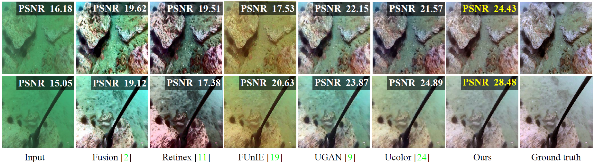
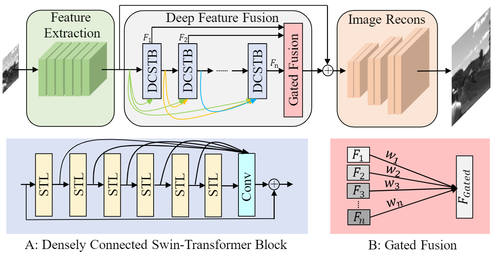
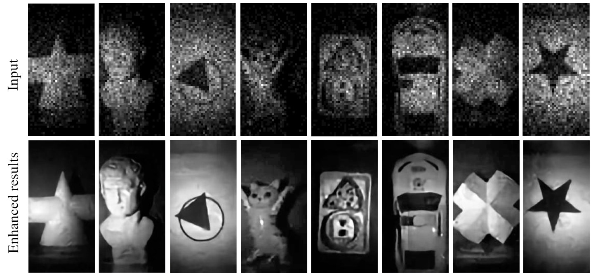
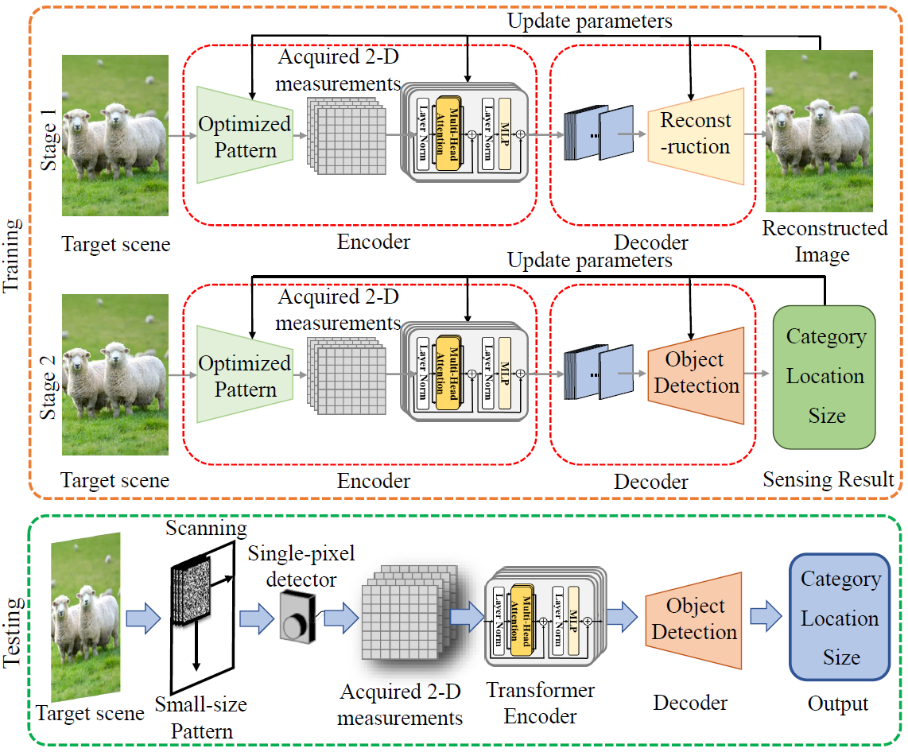
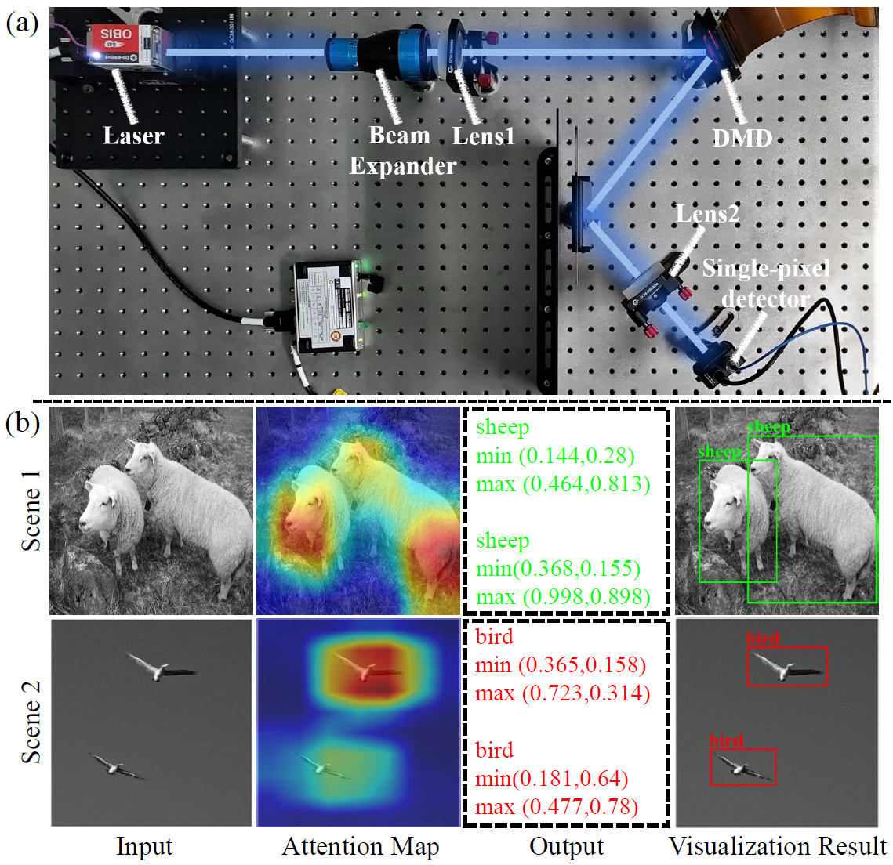

## Wide-Filed High Resolution Imaging

   Wide-field and high-resolution (HR) imaging are essential for various applications such as aviation reconnaissance, topographic mapping, and safety monitoring. The existing techniques require a large-scale detector array to capture HR images of the whole field, resulting in high complexity and heavy cost. 

​    In our research, we aim to build an agile wide-field imaging framework with selective high resolution that requires only two detectors. It builds on the statistical sparsity prior of natural scenes that the important targets locate only at small regions of interest (ROI), instead of the whole field. Under this assumption, we use a short-focal camera to image a wide field with a certain low resolution and use a long-focal camera to acquire the HR images of ROI. To automatically locate ROI in the wide field in real time, we propose an efficient deep-learning-based multiscale registration method that is robust and blind to the large setting differences (focal, white balance, etc) between the two cameras. Using the registered location, the long-focal camera mounted on a gimbal enables real-time tracking of the ROI for continuous HR imaging. We demonstrated the novel imaging framework by building a proof-of-concept setup with only 1181 gram weight, and assembled it on an unmanned aerial vehicle for air-to-ground monitoring. 

For detail information, please refer to [Agile wide-field imaging with selective high resolution](https://www.osapublishing.org/oe/fulltext.cfm?uri=oe-29-22-35602)

##  Underwater Image Enhancement

    The light absorption and scattering of underwater impurities lead to poor underwater imaging quality. The existing data-driven based underwater image enhancement (UIE) techniques suffer from the lack of a large-scale dataset containing various underwater scenes and high-fidelity reference images. Besides, the inconsistent attenuation in different color channels and space areas is not fully considered for boosted enhancement. In this work, we constructed a large-scale underwater image (LSUI) dataset including 5004 image pairs, and reported an U-shape Transformer network where the transformer model is for the first time introduced to the UIE task. The U-shape Transformer is integrated with a channel-wise multi-scale feature fusion transformer (CMSFFT) module and a spatial-wise global feature modeling transformer (SGFMT) module, which reinforce the network's attention to the color channels and space areas with more serious attenuation. Meanwhile, in order to further improve the contrast and saturation, a novel loss function combining RGB, LAB and LCH color spaces is designed following the human vision principle. The extensive experiments on available datasets validate the state-of-the-art performance of the reported technique with more than 2dB superiority. 

For detail information, please refer to [U-shape Transformer for Underwater Image Enhancement](https://lintaopeng.github.io/_pages/UIE%20Project%20Page.html)

##  Large-scale SPAD Imaging by Deep Gated Fusion Transformer

    Benefiting from the single photon detection and time stamping ability, single photon avalanche diode (SPAD) arrays have been widely applied in various fields such as fluorescence lifetime imaging and quantum computing. However, large-scale high-SNR SPAD imaging remains a big challenge due to complex hardware manufacture craft and heavy noise disturbance. In this work, we introduce deep learning into SPAD arrays, enabling super-resolution single-photon imaging with high SNR. Specifically, we first studied the photon flow model of SPAD electronics to accurately characterize multiple noise sources, and collected a real SPAD image dataset (64*32 pixels, 90 scenes, 3600 images) to calibrate noise model parameters. With this physical noise model, we for the first time synthesized a large-scale realistic SPAD image dataset (mega pixels, 17250 scenes, 1.1 million images) for subsequent network training. To tackle the super-resolution challenge of SPAD inputs with low bit depth, low resolution and heavy noise, we further built a deep transformer network with content-adaptive self-attention mechanism and gated fusion modules, which enables to remove multiple-source noise and extract full-frequency information for retrieving high-fidelity details. Extensive simulations and experiments validate the reported technique to achieve state-of-the-art SPAD super-resolution imaging over an order of magnitude.

This work is under review, the code and dataset are coming soon.

##  Single-pixel Image-free Object-detection

    Recently developed image-free sensing techniques have achieved remarkable performance in various tasks. However, the existing image-free methods still cannot simultaneously obtain the category, location and size information of all objects contained in the scene. In this letter, we report a novel image-free single-pixel object detection (SPOD) method. SPOD enables efficient and robust multi-object detection directly from a small number of measurements, eliminating the requirement for complicated image reconstruction. Different from the conventional full-size pattern sampling method, the reported small-size optimized pattern sampling method achieves better imagefree sensing performance with less number of patterns. Moreover, instead of simply stacking CNN layers, we design the SPOD based on the transformer architecture. It can better model global features, reinforce the network’s attention to the targets in the scene, thus improving the object detection performance. We demonstrate the effectiveness of SPOD on the Voc dataset, which achieves a detection accuracy of 82.41% mAP at a sampling rate of 5% with a refresh rate of 63 FPS.

This work is accepted by[Optics Letters, 2023, vol. 48, no. 10, pp. 2527-2530.](https://opg.optica.org/ol/abstract.cfm?uri=ol-48-10-2527)  
   Highlighted by [Editor's pick](https://opg.optica.org/ol/abstract.cfm?uri=ol-48-10-2527), and reported by [Optica News: Researchers detect and classify multiple objects without images](https://www.optica.org/en-us/about/newsroom/news_releases/2023/may/researchers_detect_and_classify_multiple_objects_w/).

