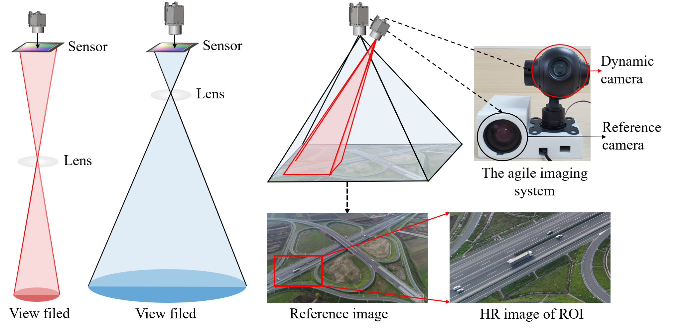
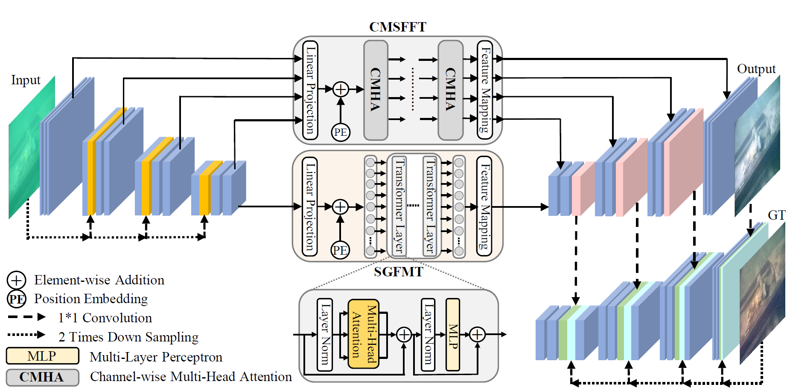

## Wide-Filed High Resolution Imaging

 Wide-field and high-resolution (HR) imaging are essential for various applications such as aviation reconnaissance, topographic mapping, and safety monitoring. The existing techniques require a large-scale detector array to capture HR images of the whole field, resulting in high complexity and heavy cost. 

In our research, we aim to build an agile wide-field imaging framework with selective high resolution that requires only two detectors. It builds on the statistical sparsity prior of natural scenes that the important targets locate only at small regions of interest (ROI), instead of the whole field. Under this assumption, we use a short-focal camera to image a wide field with a certain low resolution and use a long-focal camera to acquire the HR images of ROI. To automatically locate ROI in the wide field in real time, we propose an efficient deep-learning-based multiscale registration method that is robust and blind to the large setting differences (focal, white balance, etc) between the two cameras. Using the registered location, the long-focal camera mounted on a gimbal enables real-time tracking of the ROI for continuous HR imaging. We demonstrated the novel imaging framework by building a proof-of-concept setup with only 1181 gram weight, and assembled it on an unmanned aerial vehicle for air-to-ground monitoring. 

For detail information, please refer to [Agile wide-field imaging with selective high resolution](https://www.osapublishing.org/oe/fulltext.cfm?uri=oe-29-22-35602)

##  Underwater Image Enhancement

The light absorption and scattering of underwater impurities lead to poor underwater imaging quality. The existing data-driven based underwater image enhancement (UIE) techniques suffer from the lack of a large-scale dataset containing various underwater scenes and high-fidelity reference images. Besides, the inconsistent attenuation in different color channels and space areas is not fully considered for boosted enhancement. In this work, we constructed a large-scale underwater image (LSUI) dataset including 5004 image pairs, and reported an U-shape Transformer network where the transformer model is for the first time introduced to the UIE task. The U-shape Transformer is integrated with a channel-wise multi-scale feature fusion transformer (CMSFFT) module and a spatial-wise global feature modeling transformer (SGFMT) module, which reinforce the network's attention to the color channels and space areas with more serious attenuation. Meanwhile, in order to further improve the contrast and saturation, a novel loss function combining RGB, LAB and LCH color spaces is designed following the human vision principle. The extensive experiments on available datasets validate the state-of-the-art performance of the reported technique with more than 2dB superiority. 

For detail information, please refer to [U-shape Transformer for Underwater Image Enhancement](https://lintaopeng.github.io/_pages/UIE%20Project%20Page.html)

